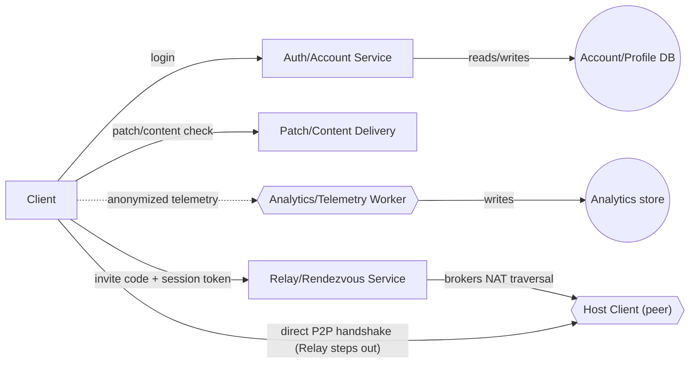
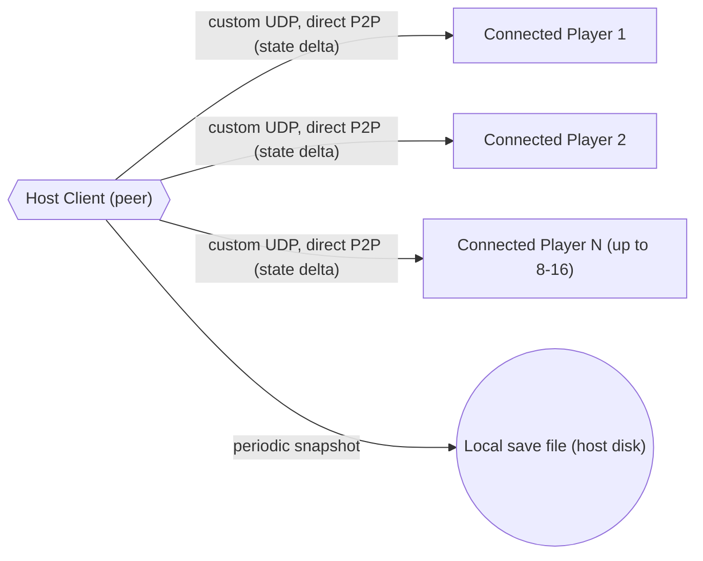

# Dwarven Engineering — Architecture

```
Legend:
  [ Name ]    generic service       <[ Name ]>   microservice / worker
  (( Name ))  database              --->  solid/pointed = sync call
  ..>  dotted/pointed = async (event/queue)   ---  unpointed = peer/bidirectional
```

## Component inventory

**Generic services (company-run)**: Auth/Account Service, Relay/Rendezvous Service, Patch/
Content Delivery Service.

**Microservices/workers (company-run)**: Analytics/Telemetry Worker — clients (host or
connected players) push anonymized gameplay/crash telemetry directly to this worker; it no
longer depends on a company-run World Server, since clients can emit events regardless of who's
hosting.

**Peer-hosted (not company infrastructure)**: Host Client — the hosting player's game client,
which is the authoritative simulation for a World session (terrain, structures, colonists,
factories/belts) and owns local persistence. Shown as a hexagon for diagramming consistency, but
it runs on a player's own machine, not company hardware — the company neither operates,
provisions, nor scales it. This replaces the previous "World Server Fleet Manager + World Server
process" design entirely (superseded, see `07-risks-and-open-questions.md`).

**Databases**: Account/Profile DB (central, company-run), Analytics store (company-run). World
save data lives locally on the Host Client's disk — not a company-run database (see Persistence
below).

Split into two diagrams — account/connection setup, and per-session P2P runtime — rather than
one dense graph.

## Diagram 1 — Account & connection setup

Rendered from [`03-architecture-diagram-1.json`](03-architecture-diagram-1.json) via the skill's
`render_diagram.py`; SVG version: [`03-architecture-diagram-1.svg`](03-architecture-diagram-1.svg).

```
[ Client ]
  |-- login --> [ Auth/Account Service ]
  |-- patch/content check --> [ Patch/Content Delivery ]
  |.. anonymized telemetry ..> <[ Analytics/Telemetry Worker ]>
  |-- invite code + session token --> [ Relay/Rendezvous Service ]
  `-- direct P2P handshake (Relay steps out) --> <[ Host Client (peer) ]>

[ Auth/Account Service ] -- reads/writes --> (( Account/Profile DB ))
<[ Analytics/Telemetry Worker ]> -- writes --> (( Analytics store ))
[ Relay/Rendezvous Service ] -- brokers NAT traversal --> <[ Host Client (peer) ]>
```



The Client fans out to every company-run entry point: telemetry is dotted (async, never
gameplay-blocking); the `direct P2P handshake` branch is the moment the Relay steps out of the
path and the Client talks straight to the Host peer.

## Diagram 2 — Per-session P2P runtime

Rendered from [`03-architecture-diagram-2.json`](03-architecture-diagram-2.json) via the skill's
`render_diagram.py`; SVG version: [`03-architecture-diagram-2.svg`](03-architecture-diagram-2.svg).
The Host Client (terrain, structures, colonists, factories/belts) ticks on the hosting player's
own machine and fans out state deltas over custom UDP to every connected player, plus periodic
local snapshots.

```
<[ Host Client (peer) ]>
  |-- custom UDP, direct P2P (state delta) --> [ Connected Player 1 ]
  |-- custom UDP, direct P2P (state delta) --> [ Connected Player 2 ]
  |-- custom UDP, direct P2P (state delta) --> [ Connected Player N (up to 8-16) ]
  `-- periodic snapshot --> (( Local save file (host disk) ))
```



Notes:
- No company infrastructure is in the real-time gameplay path — Relay/Rendezvous only brokers
  the initial connection, then steps out; the Auth/Account Service and Patch Delivery Service are
  entirely off the gameplay path. This is a stronger version of the same principle from the
  previous design (nothing latency-critical touches company infra), just with the authoritative
  component itself now also off company infra.
- The Host Client is a single point of failure by construction — if the host disconnects, the
  session ends for everyone (confirmed, not host-migrated); see `06-fault-tolerance.md`.
- Local save file is not a company-run database — it's shown as a circle for diagram consistency
  (it's still "a database" conceptually — persistent structured state) but it lives entirely on
  the host player's own disk, with no company backup or redundancy by default.

## CAP theorem tradeoffs

| Store | CP or AP | Why |
|---|---|---|
| Account/Profile DB | **CP** | Login/profile data must be consistent — no conflicting account state across replicas. Low write volume, so CP is cheap here. |
| Local save file (Host Client) | **CP**, single-writer | Only one writer (the Host Client) ever touches it — there's no distributed consistency question at all, since there are no replicas or concurrent writers to reconcile. |
| Analytics store | **AP** | Not gameplay-critical — losing or delaying a few telemetry events during a partition is an acceptable tradeoff for availability; must never be gameplay-blocking, especially now that it's the only remaining company-run write path touched during a session. |

**Note**: with company-run World Server processes gone, most of the previous CAP discussion
(World Save store CP tradeoff, Analytics store AP tradeoff) no longer applies — the company owns
far less stateful infrastructure in this design. The interesting availability question is now
entirely about the Host Client (a single peer's machine), which is a fault-tolerance concern
(see `06-fault-tolerance.md`), not a CAP tradeoff the company can engineer around.
